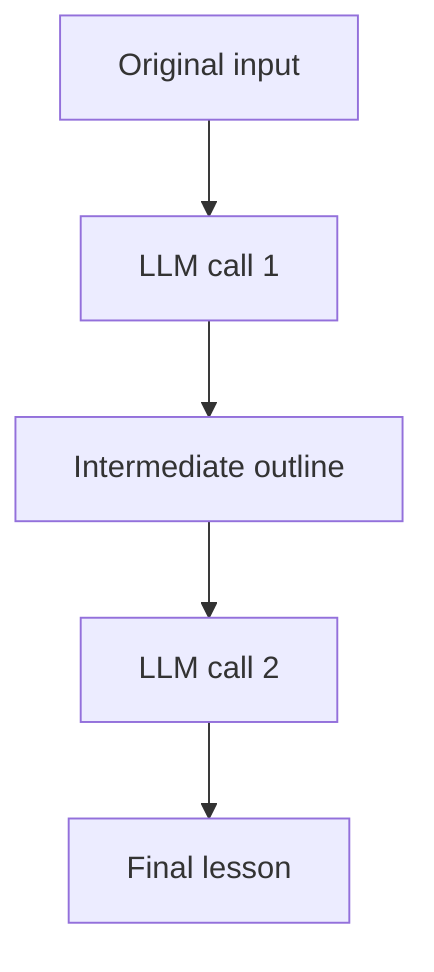
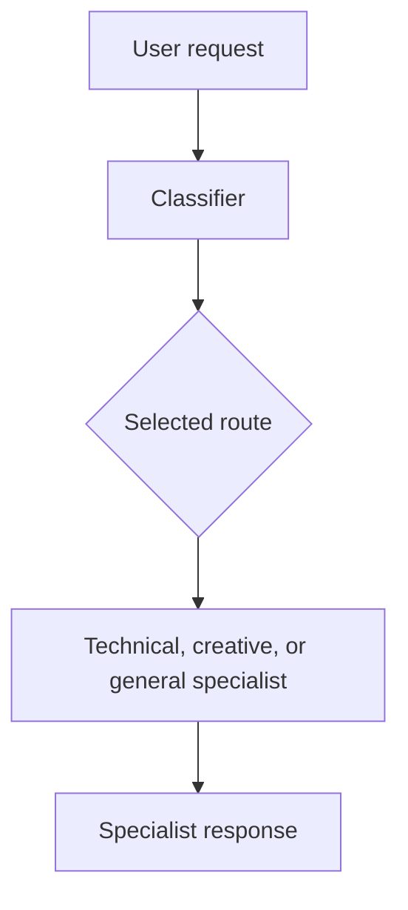
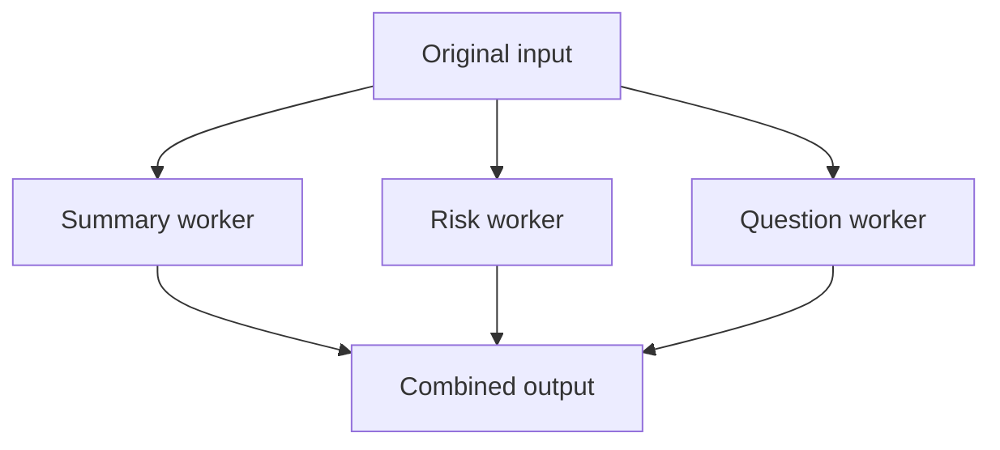
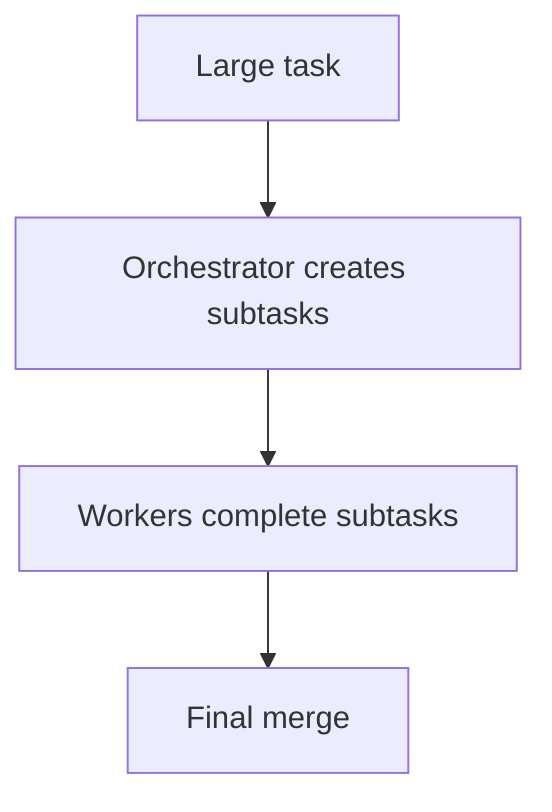
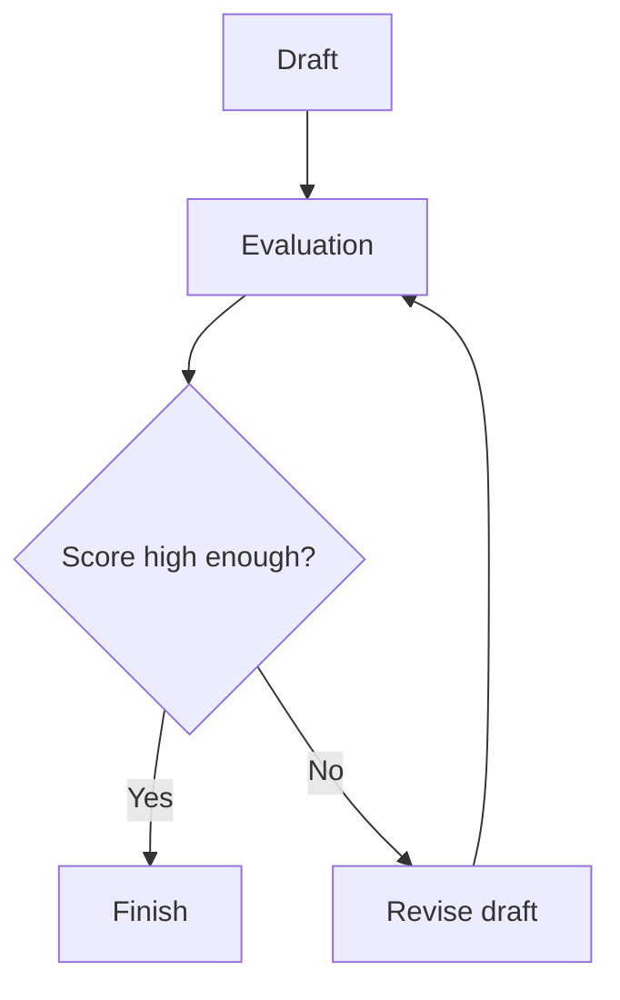

# Five Core Agent Workflow Patterns - AI SDK Lab

This repository is my **Module 1 Lab: Build Five Agent Workflow Patterns** for the **AI Agentic Engineering & Forward Deployed Engineering (FDE)** course.

The assignment requires five patterns built **from scratch with the AI SDK**, without an agent framework:

1. Prompt Chaining
2. Routing
3. Parallelization
4. Orchestrator-Worker
5. Evaluator-Optimizer

I kept each implementation as a small TypeScript program so every model call and the logic connecting those calls remain visible.

I am studying and testing one pattern at a time. Successful runs are saved under `logs/` as genuine execution evidence.

## 0. Project structure

| Location | Purpose |
|---|---|
| `README.md` | Project setup, implementation notes, testing, and submission instructions |
| `AGENTS.md` | Project assistance and assignment guardrails |
| `ASSIGNMENT_BRIEF.md` | Summary of the course requirements |
| `REFLECTION.md` | Reflection based on my actual experience |
| `.env.example` | Safe template for local API settings |
| `package.json` and `tsconfig.json` | Project packages, commands, and TypeScript settings |
| `src/lib/` | Shared model connection and logging helpers |
| `src/patterns/` | The five separate workflow implementations |
| `src/run-all.ts` | Optional command that runs all five patterns |
| `logs/` and `screenshots/` | Folders for genuine run evidence |

Each pattern has its own implementation and npm command. I run them individually so failures are easier to understand and each successful result has its own log.

## 1. Install the required software

You need:

- [VS Code](https://code.visualstudio.com/)
- [Node.js](https://nodejs.org/) version 22 or newer
- [Git](https://git-scm.com/)
- A GitHub account
- A SharedLLM virtual API key with course-provided credits

After installing Node.js and Git, open Terminal and run:

```bash
node --version
npm --version
git --version
```

If `node --version` is lower than 22, update Node.js before continuing.

## 2. Open the project in VS Code

1. Download and unzip this starter.
2. Open VS Code.
3. Select **File > Open Folder**.
4. Choose the unzipped `ai-agent-workflow-patterns-starter` folder.
5. Select **Terminal > New Terminal**.

Your terminal should be inside the project folder. You can confirm with:

```bash
pwd
```

On Windows PowerShell, use:

```powershell
Get-Location
```

## 3. Install the project packages

Run:

```bash
npm install
```

This installs:

- `ai` - the AI SDK core package
- `@ai-sdk/openai` - the AI SDK provider used with SharedLLM's OpenAI-compatible gateway
- `zod` - describes and validates structured router/planner/evaluator output
- `dotenv` - loads secret settings from `.env`
- `typescript` and `tsx` - check and run TypeScript

Next, check the code without making API calls:

```bash
npm run typecheck
```

If this command succeeds, TypeScript found no type errors. If it fails, I read the complete error before making a focused fix.

## 4. Create the API environment file

An API key is a secret password used by this program to call the model. Never paste it into a `.ts` file or upload it to GitHub.

On macOS or Linux:

```bash
cp .env.example .env
```

On Windows Command Prompt:

```bat
copy .env.example .env
```

Or duplicate `.env.example` in VS Code and rename the copy to `.env`.

Open `.env` and replace the placeholder:

```text
SHAREDLLM_API_KEY=replace_with_your_sharedllm_api_key
SHAREDLLM_BASE_URL=https://api.sharedllm.com/openai/v1
MODEL_NAME=gpt-oss:20b
```

The `.gitignore` file prevents `.env` from being committed. Still, always check `git status` before pushing.

This course uses a SharedLLM virtual key and course-provided credits. SharedLLM's documentation explains its virtual keys, OpenAI-compatible gateway, models, usage, and billing: <https://sharedllm.com/docs>.

## 5. Run the first pattern

Start with Prompt Chaining:

```bash
npm run chain
```

The terminal should show:

1. The original input
2. Step 1's outline
3. Step 2's final lesson
4. The path of a genuine execution log saved under `logs/`

To supply your own input, put it after `--`:

```bash
npm run chain -- "Plan a beginner lesson about AI agents"
```

## 6. Run all five patterns individually

Run one command at a time:

```bash
npm run chain
npm run route
npm run parallel
npm run orchestrate
npm run evaluate
```

Each successful command saves a timestamped `.txt` file in `logs/`. These real logs satisfy the brief's request for execution logs. You may also add screenshots to `screenshots/`.

After all individual commands work, you may run:

```bash
npm run all
```

`npm run all` makes many API calls, so individual runs are better while learning and debugging.

## 7. What each pattern proves

### Pattern 1 - Prompt Chaining

File: `src/patterns/01-prompt-chaining.ts`



The proof is this handoff: `outlineResult.text` is placed inside the prompt for the second `generateText()` call.

### Pattern 2 - Routing

File: `src/patterns/02-routing.ts`



The model returns a structured route. TypeScript performs the actual route selection with `specialistInstructions[decision.route]`.

### Pattern 3 - Parallelization

File: `src/patterns/03-parallelization.ts`



`Promise.all()` is the key. It waits for independent asynchronous worker calls that are started together.

### Pattern 4 - Orchestrator-Worker

File: `src/patterns/04-orchestrator-worker.ts`



Unlike fixed parallelization, the orchestrator dynamically decides the number and content of the subtasks.

### Pattern 5 - Evaluator-Optimizer

File: `src/patterns/05-evaluator-optimizer.ts`



The `for` loop creates the feedback cycle. The score threshold decides success, and the maximum number of evaluations prevents an infinite loop.

## 8. Tiny TypeScript glossary

These are the TypeScript features used throughout the five implementations:

| Syntax | Beginner meaning |
|---|---|
| `import` | Brings code from another file/package into this file. |
| `const` | Creates a variable whose binding will not be reassigned. |
| `let` | Creates a variable whose value can be reassigned. |
| `function` | Names a reusable block of instructions. |
| `async` | Marks a function that works with asynchronous operations and returns a Promise. |
| `await` | Pauses this async function until a Promise finishes. |
| `()` | Holds function parameters/arguments or calls a function. |
| `{}` | Holds a code block or an object containing named values. |
| `[]` | Creates an array/list or accesses a value by key/index. |
| `:` | Separates a name from a value/type in several TypeScript contexts. |
| `=>` | Defines an arrow function. |
| `` `text ${value}` `` | A template string that inserts a value into text. |
| `Promise.all()` | Waits for multiple asynchronous operations together. |
| `return` | Sends a value back to the caller of a function. |

## 9. Implementation notes from real testing

### SharedLLM connection

This project uses the AI SDK OpenAI provider with SharedLLM's OpenAI-compatible gateway. SharedLLM authenticates requests with `X-SharedLLM-Key`, so `src/lib/ai.ts` removes the provider's normal `Authorization` header before sending a request. The key itself is loaded from `.env` and is never stored in the source code.

### Structured output with `gpt-oss:20b`

During testing, the Routing and Orchestrator-Worker planning calls initially failed with `No object generated` errors. The model sometimes wrapped JSON in Markdown or returned property names that did not match the Zod schema.

For Routing, I added `extractJsonMiddleware()`, made the expected `route` and `reason` property names explicit, and kept Zod validation before TypeScript selects a specialist.

For Orchestrator-Worker, I used the same JSON middleware and explicit property instructions. SharedLLM later returned a plan that looked valid but was still rejected by the provider adapter, so I added a narrow fallback that uses `JSON.parse()` followed by `planSchema.safeParse()`. The workflow continues only when the same Zod schema confirms the plan is valid.

These changes are limited to provider compatibility. The five workflow patterns still use direct AI SDK calls and visible TypeScript orchestration rather than an agent framework.

### Testing and evidence

I run `npm run typecheck` before and after code changes. I then run each pattern separately and keep only real terminal output in `logs/`. Failed attempts are described honestly rather than being presented as successful evidence.

## 10. Reflection

`REFLECTION.md` is completed only after all five patterns have been run. It records the actual problems I encountered, including SharedLLM authentication, structured JSON parsing, schema validation, and the differences between fixed and dynamic workers.

## 11. Final review

Before submission, I verify that:

1. All five required patterns use direct AI SDK calls.
2. The orchestration logic remains visible in TypeScript.
3. `npm run typecheck` passes.
4. Every individual pattern command succeeds.
5. Genuine execution logs or screenshots exist for all five patterns.
6. The README explains how each implementation matches the assignment.
7. `REFLECTION.md` contains only my real experience.
8. `.env` is ignored and no API key is tracked by Git.

## 12. GitHub repository

I use Git checkpoints after each completed pattern so working progress and genuine logs are preserved. The project is available at [Navyaimmadi/-ai-agent-workflow-patterns-starter](https://github.com/Navyaimmadi/-ai-agent-workflow-patterns-starter).

Before submitting the repository, I will verify:

- All five pattern files are visible.
- README displays correctly.
- Real logs or screenshots are included.
- Reflection is completed.
- `.env` and the API key are absent.
- The repository is public.

The final course submission is the public GitHub repository URL.

## 13. Final checklist

- [x] Node.js 22 or newer is installed
- [x] `npm install` succeeds
- [x] `.env` contains a working API key and is not tracked
- [x] `npm run typecheck` succeeds
- [x] `npm run chain` succeeds
- [x] `npm run route` succeeds
- [x] `npm run parallel` succeeds
- [x] `npm run orchestrate` succeeds
- [ ] `npm run evaluate` succeeds
- [x] Real execution logs are saved for the completed patterns
- [x] README explains the patterns
- [ ] `REFLECTION.md` contains my real reflection
- [x] Repository is public on GitHub
- [ ] Public repository URL is ready to submit

## Why this lab matters

The LLM does not automatically create prompt chaining, routing, parallelization, orchestration, or evaluation. The **TypeScript code** builds those workflows by deciding when to call the model, which output becomes another input, what work can happen together, and when a feedback loop should stop.

## Official references

- [AI SDK introduction](https://ai-sdk.dev/docs/introduction)
- [AI SDK text generation](https://ai-sdk.dev/docs/ai-sdk-core/generating-text)
- [AI SDK structured data](https://ai-sdk.dev/docs/ai-sdk-core/generating-structured-data)
- [AI SDK OpenAI provider](https://ai-sdk.dev/providers/ai-sdk-providers/openai)
- [SharedLLM documentation](https://sharedllm.com/docs)
