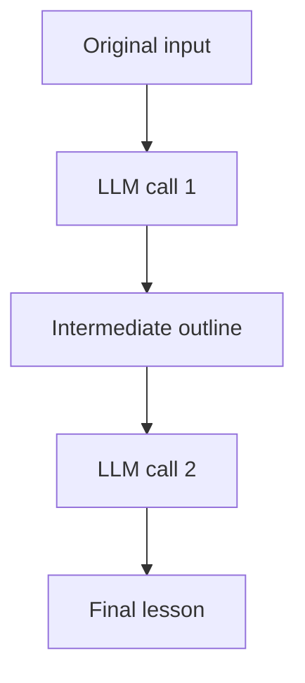
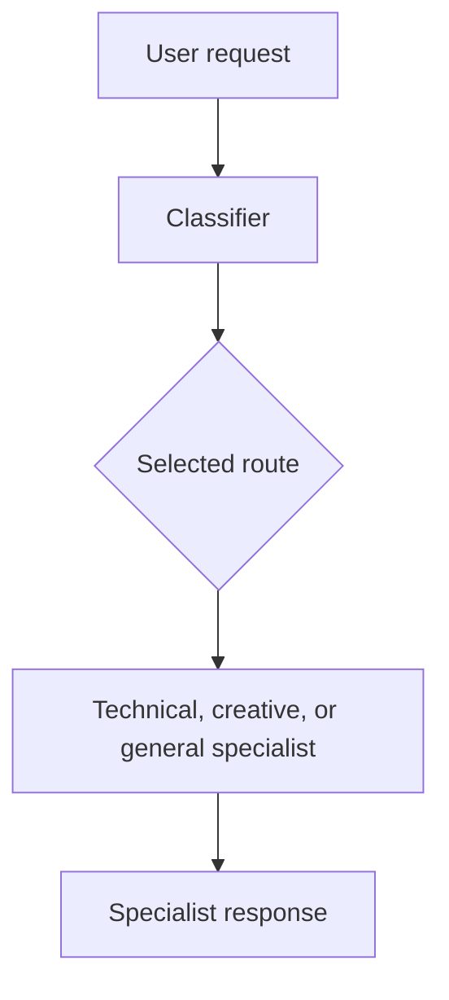
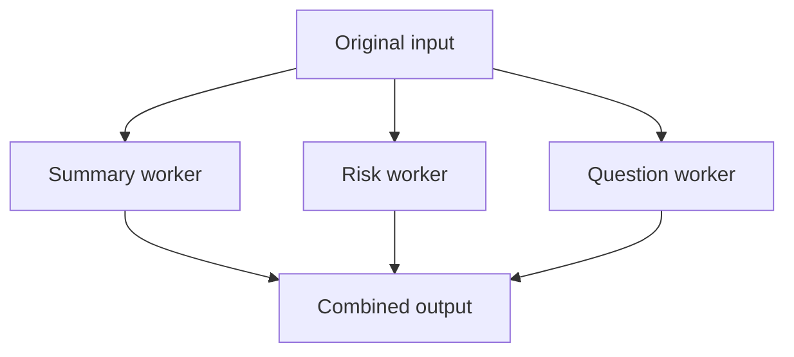
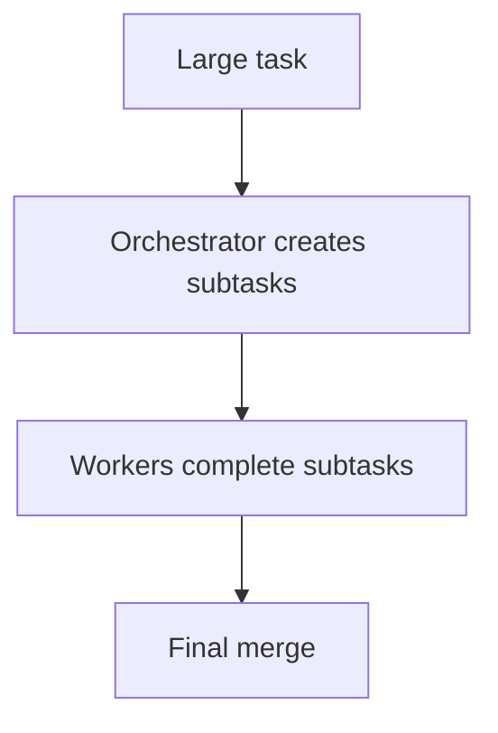
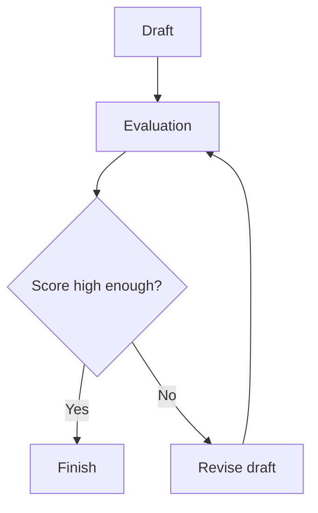

# Five Core Agent Workflow Patterns - AI SDK Lab

This is a beginner-friendly starter repository for **Module 1 Lab: Build Five Agent Workflow Patterns** in the **AI Agentic Engineering & Forward Deployed Engineering (FDE)** course.

The assignment requires five patterns built **from scratch with the AI SDK**, without an agent framework:

1. Prompt Chaining
2. Routing
3. Parallelization
4. Orchestrator-Worker
5. Evaluator-Optimizer

The code is intentionally kept as small TypeScript programs. You can see every LLM call and the TypeScript logic connecting those calls.

> Do not submit this project blindly. Run it, study one pattern at a time, keep genuine execution evidence, and write the reflection from your real experience.

## 0. What is already included?

| Location | Purpose |
|---|---|
| `README.md` | Your complete setup, learning, testing, and submission instructions |
| `AGENTS.md` | Tells Codex how to help without violating the assignment |
| `ASSIGNMENT_BRIEF.md` | A clean summary of the attached course brief |
| `REFLECTION.md` | A template to complete from your real experience |
| `.env.example` | Safe template for local API settings |
| `package.json` and `tsconfig.json` | Project packages, commands, and TypeScript settings |
| `src/lib/` | Shared model connection and logging helpers |
| `src/patterns/` | The five separate workflow implementations |
| `src/run-all.ts` | Optional command that runs all five patterns |
| `logs/` and `screenshots/` | Folders for genuine run evidence |

Each pattern has a working implementation structure. You still need to install the software, add your API key, run each command, understand the code, and complete the reflection.

## 1. Install the required software

You need:

- [VS Code](https://code.visualstudio.com/)
- [Node.js](https://nodejs.org/) version 22 or newer
- [Git](https://git-scm.com/)
- A GitHub account
- A SharedLLM virtual API key with course-provided credits
- Recommended: Codex in VS Code

After installing Node.js and Git, open Terminal and run:

```bash
node --version
npm --version
git --version
```

If `node --version` is lower than 22, update Node.js before continuing.

## 2. Open the starter in VS Code

1. Download and unzip this starter.
2. Open VS Code.
3. Select **File > Open Folder**.
4. Choose the unzipped `ai-agent-workflow-patterns-starter` folder.
5. Select **Terminal > New Terminal**.

Your terminal should be inside the project folder. You can confirm with:

```bash
pwd
```

On Windows PowerShell, use:

```powershell
Get-Location
```

## 3. Install the project packages

Run:

```bash
npm install
```

This installs:

- `ai` - the AI SDK core package
- `@ai-sdk/openai` - the AI SDK provider used with SharedLLM's OpenAI-compatible gateway
- `zod` - describes and validates structured router/planner/evaluator output
- `dotenv` - loads secret settings from `.env`
- `typescript` and `tsx` - check and run TypeScript

Next, check the code without making API calls:

```bash
npm run typecheck
```

If this command succeeds, TypeScript found no type errors. If it fails, copy the complete error into Codex and ask for a simple explanation before making a fix.

## 4. Create the API environment file

An API key is a secret password used by this program to call the model. Never paste it into a `.ts` file or upload it to GitHub.

On macOS or Linux:

```bash
cp .env.example .env
```

On Windows Command Prompt:

```bat
copy .env.example .env
```

Or duplicate `.env.example` in VS Code and rename the copy to `.env`.

Open `.env` and replace the placeholder:

```text
SHAREDLLM_API_KEY=replace_with_your_sharedllm_api_key
SHAREDLLM_BASE_URL=https://api.sharedllm.com/openai/v1
MODEL_NAME=gpt-oss:20b
```

The `.gitignore` file prevents `.env` from being committed. Still, always check `git status` before pushing.

This course uses a SharedLLM virtual key and course-provided credits. SharedLLM's documentation explains its virtual keys, OpenAI-compatible gateway, models, usage, and billing: <https://sharedllm.com/docs>.

## 5. Run the first pattern

Start with Prompt Chaining:

```bash
npm run chain
```

The terminal should show:

1. The original input
2. Step 1's outline
3. Step 2's final lesson
4. The path of a genuine execution log saved under `logs/`

To supply your own input, put it after `--`:

```bash
npm run chain -- "Plan a beginner lesson about AI agents"
```

## 6. Run all five patterns individually

Run one command at a time:

```bash
npm run chain
npm run route
npm run parallel
npm run orchestrate
npm run evaluate
```

Each successful command saves a timestamped `.txt` file in `logs/`. These real logs satisfy the brief's request for execution logs. You may also add screenshots to `screenshots/`.

After all individual commands work, you may run:

```bash
npm run all
```

`npm run all` makes many API calls, so individual runs are better while learning and debugging.

## 7. What each pattern proves

### Pattern 1 - Prompt Chaining

File: `src/patterns/01-prompt-chaining.ts`



The proof is this handoff: `outlineResult.text` is placed inside the prompt for the second `generateText()` call.

### Pattern 2 - Routing

File: `src/patterns/02-routing.ts`



The model returns a structured route. TypeScript performs the actual route selection with `specialistInstructions[decision.route]`.

### Pattern 3 - Parallelization

File: `src/patterns/03-parallelization.ts`



`Promise.all()` is the key. It waits for independent asynchronous worker calls that are started together.

### Pattern 4 - Orchestrator-Worker

File: `src/patterns/04-orchestrator-worker.ts`



Unlike fixed parallelization, the orchestrator dynamically decides the number and content of the subtasks.

### Pattern 5 - Evaluator-Optimizer

File: `src/patterns/05-evaluator-optimizer.ts`



The `for` loop creates the feedback cycle. The score threshold decides success, and the maximum number of evaluations prevents an infinite loop.

## 8. Tiny TypeScript glossary

Use this before asking Codex for the full line-by-line explanation:

| Syntax | Beginner meaning |
|---|---|
| `import` | Brings code from another file/package into this file. |
| `const` | Creates a variable whose binding will not be reassigned. |
| `let` | Creates a variable whose value can be reassigned. |
| `function` | Names a reusable block of instructions. |
| `async` | Marks a function that works with asynchronous operations and returns a Promise. |
| `await` | Pauses this async function until a Promise finishes. |
| `()` | Holds function parameters/arguments or calls a function. |
| `{}` | Holds a code block or an object containing named values. |
| `[]` | Creates an array/list or accesses a value by key/index. |
| `:` | Separates a name from a value/type in several TypeScript contexts. |
| `=>` | Defines an arrow function. |
| `` `text ${value}` `` | A template string that inserts a value into text. |
| `Promise.all()` | Waits for multiple asynchronous operations together. |
| `return` | Sends a value back to the caller of a function. |

## 9. Continue with Codex in VS Code

`AGENTS.md` gives Codex permanent instructions for this project. Begin with:

```text
Read AGENTS.md, ASSIGNMENT_BRIEF.md, README.md, package.json, and every file under src before changing anything.

This is my Module 1 lab and I am a beginner. First explain the repository structure and show how each of the five files maps to the assignment. Do not replace the visible workflow logic with ToolLoopAgent or any agent framework. Then run npm run typecheck. Explain any error in simple language and make only necessary fixes.
```

Then study one pattern at a time.

### Codex prompt for Pattern 1

```text
Focus only on src/patterns/01-prompt-chaining.ts. Explain every important line from the ground up, including import, const, async, await, generateText, model, system, prompt, variables, template strings, .text, and return. Show exactly where the first output becomes the second input. Then run npm run chain. If it works, do not rewrite it unnecessarily.
```

### Codex prompt for Pattern 2

```text
Focus only on src/patterns/02-routing.ts. Explain the schema, Output.object, z.object, z.enum, type, Record, and how the classifier output becomes a TypeScript route. Explain why application code performs the route. Then run npm run route and fix only verified errors.
```

### Codex prompt for Pattern 3

```text
Focus only on src/patterns/03-parallelization.ts. Explain arrays, map, the async arrow function, promises, and Promise.all from the beginning. Show why the three LLM tasks are independent. Then run npm run parallel. Keep the from-scratch pattern recognizable.
```

### Codex prompt for Pattern 4

```text
Focus only on src/patterns/04-orchestrator-worker.ts. Explain the orchestrator schema, how subtasks are created dynamically, how map creates worker calls, how Promise.all runs workers, JSON.stringify, and how the final merge works. Then run npm run orchestrate and fix only verified errors.
```

### Codex prompt for Pattern 5

```text
Focus only on src/patterns/05-evaluator-optimizer.ts. Explain the initial draft, for loop, evaluation number, score threshold, maximum evaluations, break, revision call, and how feedback is passed into the next draft. Then run npm run evaluate and fix only verified errors.
```

## 10. Complete the reflection honestly

After you have run all five patterns, open `REFLECTION.md` and answer from your real experience. Codex can improve grammar, but it must not invent challenges or lessons.

Suggested Codex prompt:

```text
Ask me one question at a time about what happened while I built and ran this lab. Use my answers to help me complete REFLECTION.md in simple, natural language. Do not invent anything I did not tell you.
```

## 11. Ask Codex for a strict final review

Use this only after the individual runs succeed:

```text
Act as a strict reviewer. Compare ASSIGNMENT_BRIEF.md with this repository.

Verify:
1. All five required patterns exist and use low-level AI SDK calls.
2. No agent framework replaced the manual workflow logic.
3. npm run typecheck passes.
4. Each individual npm script runs successfully.
5. Real logs or screenshots exist for all five patterns.
6. README explains every pattern.
7. REFLECTION.md contains my real completed reflection.
8. .env is ignored and no API key is tracked by Git.

Do not fabricate run evidence or reflection text. Report what is still missing and fix only verifiable code/documentation issues.
```

## 12. Put the project on GitHub

In the VS Code terminal:

```bash
git init
git add .
git status
```

Carefully confirm that `.env` is **not** listed. Then commit:

```bash
git commit -m "Build five AI agent workflow patterns"
```

On GitHub:

1. Create a new repository.
2. Set it to **Public**.
3. Do not add another README, `.gitignore`, or license on GitHub because the starter already contains the needed project files.
4. Copy GitHub's commands for pushing an existing repository.

They will look similar to:

```bash
git branch -M main
git remote add origin YOUR_GITHUB_REPOSITORY_URL
git push -u origin main
```

Replace `YOUR_GITHUB_REPOSITORY_URL` with your real URL.

Open the GitHub repository in your browser and verify:

- All five pattern files are visible.
- README displays correctly.
- Real logs or screenshots are included.
- Reflection is completed.
- `.env` and the API key are absent.
- The repository is public.

Submit only the public GitHub repository URL to the course.

## 13. Final checklist

- [ ] Node.js 22 or newer is installed
- [ ] `npm install` succeeds
- [ ] `.env` contains a working API key and is not tracked
- [ ] `npm run typecheck` succeeds
- [ ] `npm run chain` succeeds
- [ ] `npm run route` succeeds
- [ ] `npm run parallel` succeeds
- [ ] `npm run orchestrate` succeeds
- [ ] `npm run evaluate` succeeds
- [ ] Real execution logs or screenshots are saved
- [ ] README explains the patterns
- [ ] `REFLECTION.md` contains your real reflection
- [ ] Repository is public on GitHub
- [ ] Public repository URL is ready to submit

## Why this lab matters

The LLM does not automatically create prompt chaining, routing, parallelization, orchestration, or evaluation. The **TypeScript code** builds those workflows by deciding when to call the model, which output becomes another input, what work can happen together, and when a feedback loop should stop.

## Official references

- [AI SDK introduction](https://ai-sdk.dev/docs/introduction)
- [AI SDK text generation](https://ai-sdk.dev/docs/ai-sdk-core/generating-text)
- [AI SDK structured data](https://ai-sdk.dev/docs/ai-sdk-core/generating-structured-data)
- [AI SDK OpenAI provider](https://ai-sdk.dev/providers/ai-sdk-providers/openai)
- [SharedLLM documentation](https://sharedllm.com/docs)
